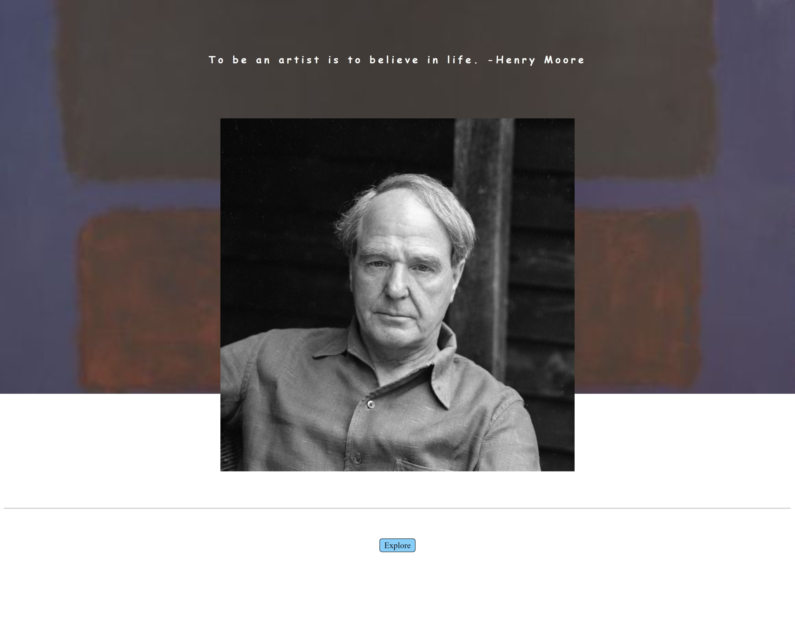

># Art-tracking-app

This is the first group project of our class work! The idea behind the project came from our group member Kayla and the overall theme was to strengthen the user's connection to gallery art work that is available for in-person viewing. The site itself uses two different APIs from two art collections and returns a listing of art pieces currently on dicplay at their respective facilities. We went with the Metropolitan museum of Art and the Walters art history museum. These two API's had subtle differences in the way they handle search queries that we feel lended to a certain flexibility for the user. The Walters collection is organized largely ethnographically so this gives the user tha ability to search by cultures (e.g. Chinese or French) and the Met had a keyword creator search which allows it to return more specific results based on the artist's name.

---

## Project Goals

- Help to connect people with art-work in galleries that are within their reach.
- Avoid unrelated search results that inevitably occur when searching with large search engines.
- Enhance the visibility of museum and gallery collections by showing off their collections in a centralized location.

---

## Future Additions

- We would like to add many more collections to the search results
- We would also like to add customization to the search function, allowing you to select your location and search nearby collections available for viewing.
-The original hope for the project was to allow the user to search an artist and to return the  gallery locations of said artists works, this is a feature we are working towards.
- We would like to make the results page a moreinteractive experience once the results are displayed.

---

### Please find a link to the site below along with screenshots of the current pages.

[Link to Site](https://jmcdonald112358.github.io/Art-tracking-app/)

